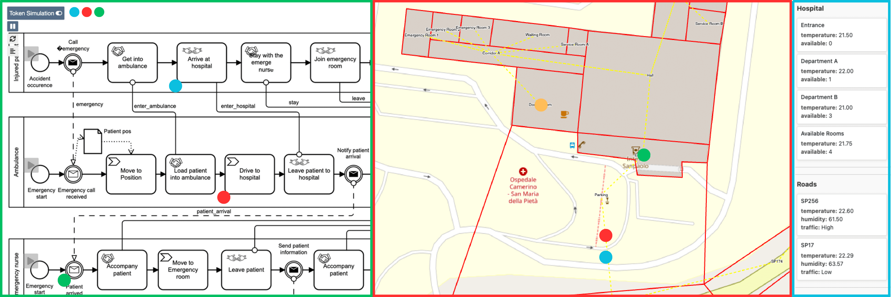
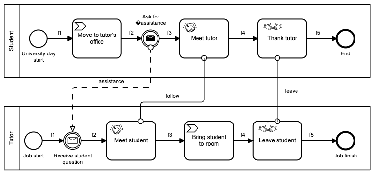
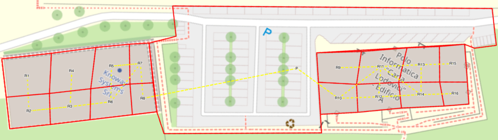
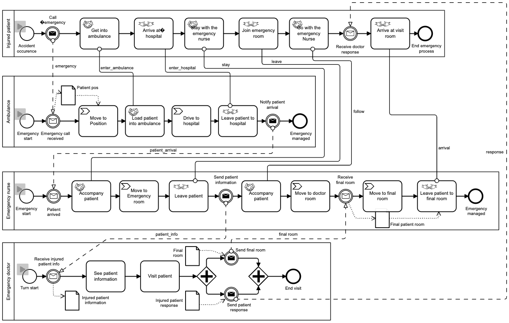
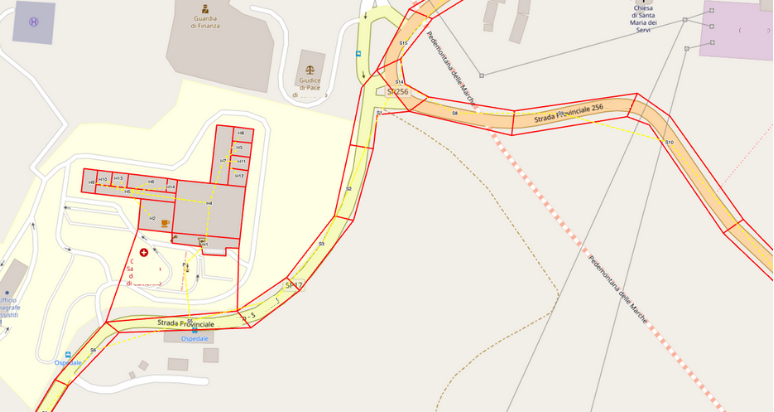

# Environment-aware BPMN Animator

Business processes, in particular collaborations, describe how various participants interact and behave to achieve specific objectives.
Depending on the business scenario, process participants operate in a specific environment characterized by spatial and contextual dimensions.
Participants can interact with and modify the environment, which in turn may influence process execution.
Indeed, there exists a bidirectional relationship between business processes and the environment, which involves the necessity of representing the environment in a way that allows business processes to benefit from its awareness.
Despite extensive research on environment modeling, the seamless integration of business processes and the environment model is not fully explored yet.
To address this gap, we propose a tool for animating environment-aware BPMN collaborations with the aid of geographical maps (see figure below).

<span style="color:red;font-weight:750;">
In this repository, beyond the tool's source code, you can find a case studies folder containing .zip files for various scenario. 
The case studies folder contains .zip files for various scenarios, including both functional and intentionally erroneous models, to demonstrate the tool's capabilities.
The .zip files can be uploaded in the tool by clicking on the (top-right) Open button.</span>



## Table of Contents
- [Environment-aware BPMN Animator](#environment-aware-bpmn-animator)
    - [Table of Contents](#table-of-contents)
    - [Installation](#installation)
        - [Manual installation](#manual-installation)
        - [Docker installation](#docker-installation)
    - [Case studies](#case-studies)
        - [University Compound](#university-compound)
        - [Hospital](#hospital)
    - [Animating and Debugging environment-aware BPMN collaborations](#animating-and-debugging-environment-aware-bpmn-collaborations)
    - [Modeling environment-aware BPMN collaborations](#modeling-environment-aware-bpmn-collaborations)
        - [Environment Modeling](#environment-modeling)
        - [BPMN Collaboration Modeling](#bpmn-collaboration-modeling)
    - [License](#license)

## Installation
### Manual installation
To install the tool, follow these steps:
1. Run `npm install` to install the dependencies.
2. Run `npm run start` to start a [local instance](http://localhost:8080).

### Docker installation
To install Environment-aware BPMN Animator, follow these steps:
1. Run `docker build -t envbpmnanimator .` to build the Docker image.
2. Run `docker run -p 8080:8080 envbpmnanimator` to start a [local instance](http://localhost:8080).

## Case studies
Environment-aware BPMN Animator makes it possible to upload an environment-aware BPMN collaboration model by clicking on the ***Open*** button. 
When uploading a model, a `.zip` file containing the `.bpmn` file and the space `.json` file will have to be provided by the user.
You can find `.zip` files of case studies in the `case studies` folder of this repository. 
Each case study is available in a fully functional variant and others with intentional modeling errors to showcase the tool’s capabilities.

### University Compound
This case study illustrates a scenario where a student seeks guidance from their tutor. The collaboration involves a `Student` and a `Tutor` and it takes place in a university compound.
- `student.zip` <span style="color:green;">(happy path)</span>
- `student_different.zip`  <span style="color:#FFDE21;">(different positions)</span>
- `student_unreachable.zip`  <span style="color:#FFDE21;">(unreachable destination)</span>
- `student_discordant.zip`  <span style="color:red;">(discordant movements)</span>




### Hospital
This case study demonstrates a situation where an injured patient requires medical assistance. The collaboration involves an `Injured Patient`, `Emergency Nurse`, `Emergency Doctor` and `Ambulance`. It takes place in a hospital and its sorroundings.
- `ambulance.zip` <span style="color:green;">(happy path)</span>
- `ambulance_guard.zip` <span style="color:#FFDE21;">(violated guard)</span>
- `ambulance_missing.zip` <span style="color:red;">(missing position)</span>




## Animating and Debugging environment-aware BPMN collaborations

Environment-aware BPMN Animator embeds an animator capable of representing step-by-step the environment-aware BPMN collaboration execution. By selecting the Token Simulation button top-left corner, a play button will appear over each fireable start event. Once this button is clicked, one process is activated. This creates a new token in the form of a small colored circle at the start event of the BPMN collaboration and another token in place of the environment model corresponding to the set position of the pool, which starts to cross the two models.
  
The **data panel** in the right side of the Environment-aware BPMN Animator interface allows users to keep track of the environment evolution throughout the animation. At any time, the animation can be paused by the user to check the distribution of the tokens in the environment and in the BPMN collaboration.

The animation terminates once all tokens cannot move forward. In the case of deadlocks or potential deadlock situations, Environment-aware BPMN Animator will highlight the cause using either <span style="color:#FFDE21;">yellow</span> or <span style="color:red;">red</span> color.

## Modeling environment-aware BPMN collaborations
### Environment Modeling
The environment is modeled in JSON (JavaScript Object Notation) and overlaid onto a geographic map for enhanced visualization. 
Thanks to its lightweight and language-independent nature, JSON is
widely used for data interchange, making this model representation reusable across different applications. 
The model can be generated with the assistance of online tools for [JSON formatting](https://jsonformatter.org/json-editor) and [coordinate extrapolation](https://www.keene.edu/campus/maps/tool/).

The model attains to the following structure:
```
{
    "map": {
        "center": [latitude, longitude], // Center coordinates of the map
        "extent": [minLongitude, minLatitude, maxLongitude, maxLatitude], // Extent of the map
        "zoom": zoomLevel, // Zoom level of the map
        "rotation": rotationAngle // Rotation angle of the map
    },
    "places": [
        {
            "id": "uniquePlaceId", // Unique identifier for the place
            "name": "placeName", // Name of the place
            "extent": [
                [latitude, longitude], // Coordinates defining the boundaries of the place
                ...
            ],
            "attributes": {
                "attribute1": "value",
                "attribute2": "value",
                ...
                "attribute_n": "value"
            } //Edge attributes (optional)
        },
        ...
    ],
    "edges": [
        {
            "id": "uniqueEdgeId", // Unique identifier for the edge
            "name": "edgeName", // Name of the edge
            "source": "sourcePlaceId", // Source place ID
            "target": "targetPlaceId", // Target place ID,
            "attributes": {
                "attribute1": "value",
                "attribute2": "value",
                ...
                "attribute_n": "value"
            } //Edge attributes (optional)
        },
        ...
    ],
    "sets": [
        {
            "id": "uniqueLogicalPlaceId", // Unique identifier for the logical place
            "name": "logicalPlaceName", // Name of the logical place
            "expression": "filterExpression", // Expression to filter places (e.g., "zone === 'A'")
        },
        ...
    ],
    "views": [
        {
            "id": "uniqueViewId", // Unique identifier for the view
            "name": "viewName", // Name of the view
            "sets": ["setId1", "setId2"], // List of logical place IDs included in the view
            "aggregation": {
                "attribute1": "aggrFun" // Aggregation function (optional)
            },
            "disaggregation": {
                "attribute1": "disaggrFun" // Disaggregation function (optional)
            }
        },
        ...
    ]
}
```

### BPMN Collaboration Modeling

Environment-aware BPMN Animator embeds a user-friendly modeler (on the left) used to design the BPMN collaboration processes.
For each element, it is possible to define additional properties using the **element palette**. One or more **environmental attributes** can be set for a place in the environmental model by using the associated property panel. In order to define an environmental attribute, it is necessary to define its name and its initial value. Environmental attributes can be referenced by other elements in the models by using the following notation: `place_name.attribute_name`.

An **initial position** corresponding to one of the places in the environmental model can be set for each **pool**, which represents participant in the collaboration.

**Tasks** in the model will include a new **Assignments** property used to modify the value of environmental attributes. Assignments are defined by specifying the name of a defined attribute (e.g. `place1.temperature`) and its new value (e.g. `25`).
**Tasks** will also include a **Guards** property used to assess the value of environmental attributes prior to execution. Guards are defined by specifying the name of a defined attribute (e.g. `place1.temperature`), a logical operator (e.g. `=<`) and a value (e.g. `25`).

New types of **Tasks** are also introduced in the modeler:
*   **Movement Tasks** are used to move a participant within the environment, modifying its position. A **Destination** attribute indicates the place that the participant wants to reach from its current position. The destination has to be defined by selecting one of the places defined in the environmental model or by specifying the name of an attribute that contains the name of a place.
*   **Binding Tasks** and **Unbinding Tasks** are used to synchronize movements between participants. **Movement Tasks** performed after a **Binding Task** will affect all the bound participants, until they reach the next **Unbinding Task**.

## License

Environment-aware BPMN Animator © 2025 is licensed under [CC BY 4.0](https://creativecommons.org/licenses/by/4.0/?ref=chooser-v1) 
