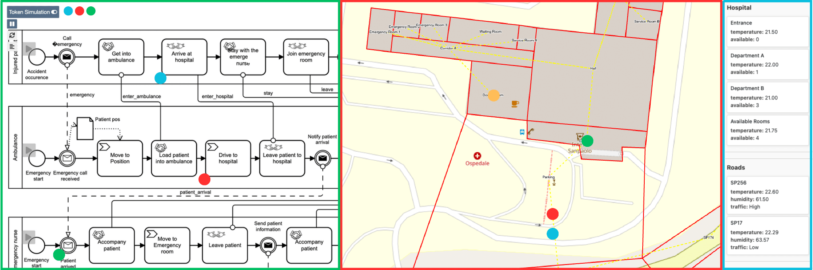

# Environment-aware BPMN Animator

NOTE FOR REVIEWERS:
You can find several case studies in [the following repository](https://bitbucket.org/proslabteam/environmental-bpmn-collaboration-models/src/main/BEAR2.0/2025). Each .zip file includes both a BPMN collaboration model and its corresponding environment model. These .zip files can be downloaded and directly uploaded into the tool—ready for animation—by clicking the Open button in the top-right corner.

Business processes, in particular collaborations, describe how various participants interact and behave to achieve specific objectives.
Depending on the business scenario, process participants operate in a specific environment characterized by spatial and contextual dimensions.
Participants can interact with and modify the environment, which in turn may influence process execution.
Indeed, there exists a bidirectional relationship between business processes and the environment, which involves the necessity of representing the environment in a way that allows business processes to benefit from its awareness.
Despite extensive research on environment modeling, the seamless integration of business processes and the environment model is not fully explored yet.
To address this gap, we propose a tool for animating environment-aware BPMN collaborations with the aid of geographical maps (see figure below).

## Installation
### Manual installation

To install the tool, follow these steps:

1. Run `npm install` to install the dependencies.
2. Run `npm run start` to start a [local instance](http://localhost:8080).

## License

A detailed user guide, screenshots and a tool demonstration video are avilable at the [following website](https://pros.unicam.it/environmental-bpmn/).

## License

Environment-aware BPMN Animator © 2025 is licensed under [CC BY 4.0](https://creativecommons.org/licenses/by/4.0/?ref=chooser-v1) 
